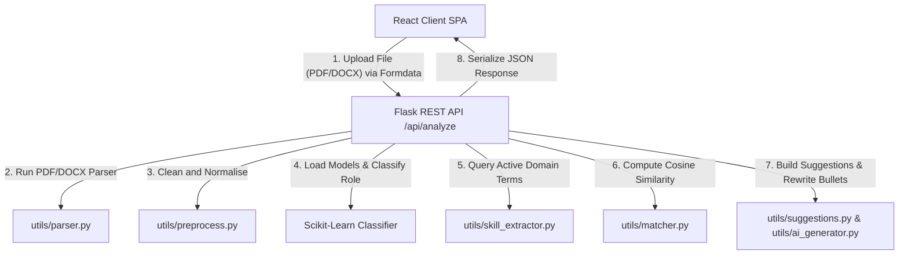

# Nexus AI Resume Builder

Nexus AI Resume Builder is a premium, high-fidelity resume intelligence and optimization platform. The system integrates machine learning algorithms for domain classification, keyword matching, and passive-to-active narrative polishing. 

The application features a modern, fluid **Atmospheric Glass** user interface built in **React**, decoupled from a robust, state-of-the-art **Flask** processing pipeline.

---

## Architecture Flow



---

## Key Features

*   **Multi-Format Document Parsing**: High-fidelity text extraction from `.pdf` and `.docx` source files utilizing layout-aware parsers.
*   **ML Role Classification**: Automatically maps candidate profiles across 17 distinct professional fields (such as Python Developer, Data Scientist, ML Engineer, DevOps, Cybersecurity Analyst, Financial Analyst, and UI/UX Designer) with dynamic confidence scoring.
*   **ATS Similarity Scoring**: Computes word-vector match percentages against customized Job Descriptions or role baselines utilizing Cosine Similarity.
*   **Resume DNA Profiling**: Generates a 5-dimensional competency rating (Technical, Leadership, Impact, Communication, and Problem Solving) using structural keywords and semantic density.
*   **Captured vs. Gapped Skills**: Visualizes extracted competencies (green) alongside identified vulnerabilities/missing keywords (red) in real-time badges.
*   **Active Verb Optimizer**: Rewrites passive vocabulary (e.g. *worked on*, *helped*) into high-impact action verbs (e.g. *Spearheaded*, *Orchestrated*, *Architected*).

---

## Technology Stack

### Backend
*   **Python 3.11** - Main backend runtime.
*   **Flask** - Micro-web API router serving JSON endpoints.
*   **Scikit-Learn** - Machine learning modeling (`TfidfVectorizer` + classification model).
*   **pdfplumber** & **python-docx** - Document extraction utilities.
*   **Joblib** - ML model serialization.

### Frontend
*   **React 19** - UI composition.
*   **Vite 8** - Fast, lightweight build system.
*   **Vanilla CSS** - Bespoke dark-theme glassmorphism styles.

---

## API Documentation

### `POST /api/analyze`
Processes a raw resume document against an optional job description to extract structured analysis parameters.

*   **Content-Type**: `multipart/form-data`
*   **Request Parameters**:
    *   `resume` (File): Binary `.pdf` or `.docx` file (Required)
    *   `job_description` (String): Target job requirements (Optional)

*   **Response Schema (`200 OK`)**:
    ```json
    {
      "success": true,
      "predicted_role": "Python Developer",
      "confidence": 92.5,
      "ats_score": 78.42,
      "matched_skills": ["python", "django", "flask", "sql"],
      "missing_skills": ["redis", "docker"],
      "resume_dna": {
        "technical": 80,
        "leadership": 45,
        "impact": 50,
        "communication": 65,
        "problem_solving": 75
      },
      "suggestions": [
        "Content Density: Your profile is relatively brief...",
        "Our heuristics identified a deficit in Redis. Direct injection is recommended."
      ],
      "enhanced_bullets": [
        "Spearheaded database queries optimization.",
        "Architected REST APIs for order processing."
      ]
    }
    ```

---

## Installation & Setup

### Prerequisites
*   Python 3.11+
*   Node.js (v18+) & npm

### 1. Backend Server Setup
From the project root directory:

```bash
# Create and activate virtual environment
python -m venv venv
# Windows:
.\venv\Scripts\Activate.ps1
# Unix/macOS:
source venv/bin/activate

# Install requirements
pip install -r requirements.txt

# Run the Flask backend
python app.py
```
The server starts on `http://127.0.0.1:5000`.

### 2. Frontend Development Server Setup
In a new terminal:

```bash
cd frontend
npm install
npm run dev
```
Open your browser to the local dev address (typically `http://localhost:5173`).

---

## Screenshots & Interface Walkthrough

*(Place screenshots or demo GIFs here to demonstrate the interface)*

1.  **Idle State / Upload View**: Clear drag-and-drop panel with glassmorphism hover animations.
2.  **Analysis Summary Panel**: Suitable role with confidence rating ring and ATS compatibility scores.
3.  **Resume DNA & Skills**: Responsive grid visualization highlighting competencies, vulnerabilities, and metrics.
4.  **Improvement & Polishing**: Bullet recommendations showing direct side-by-side action transformations.

---

## Future Improvements
*   **Local LLM Integration**: Incorporate an offline Ollama backend instance for advanced contextual summaries.
*   **Dynamic Highlighting**: Add an interactive text viewer in the React UI with heatmap highlights for captured skills.
*   **Template Exporters**: Enable export options to download parsed and enhanced content directly to cleanly styled PDF templates.

---

## License

This project is licensed under the MIT License - see the LICENSE file for details.
